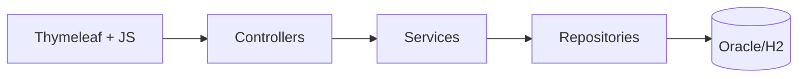

# RevShop Architecture

## High-Level

RevShop follows a layered monolithic architecture:

1. Presentation Layer
- Thymeleaf pages (`/templates`)
- Static JS/CSS (`/static`)
- REST + MVC controllers

2. Application Layer
- Services implement business rules for auth, catalog, cart, checkout, payment, notifications, favorites, reviews

3. Persistence Layer
- Spring Data JPA repositories
- Hibernate ORM mapping to Oracle/H2

## Component Flow

## Security Model
- Form login (`/login`) with session-based authentication
- JWT authentication for API clients via `Authorization: Bearer <token>` (`POST /api/auth/login`)
- Role-based authorization:
  - Buyer: cart/order/payment/favorites/reviews
  - Seller: inventory/order status/review visibility
- Method-level guards via `@PreAuthorize`
- CSRF protection enabled with cookie token repository

## Key Domain Modules
- Identity: buyer/seller registration and login
- Catalog: category and product management
- Cart: cart item lifecycle and total calculation
- Checkout: cart-to-order conversion with stock checks
- Payment: single payment per order, simulated methods
- Notifications: order and stock event alerts
- Favorites: buyer product bookmarks
- Reviews: buyer rating/comment on purchased products

## Data Consistency
- Transactions on write-heavy use cases (`checkout`, `pay`, `add/update product`, `cart updates`, `favorite/review writes`)
- Unique constraints:
  - user email
  - favorite (buyer, product)
  - review (buyer, product)
  - payment per order
