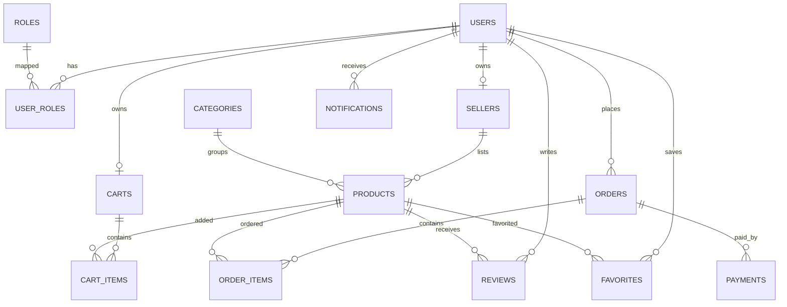

# ERD

## Key Entities
- `users`: buyer/seller auth and profile data
- `sellers`: business profile for seller users
- `products`: catalog with stock and threshold
- `orders` and `order_items`: checkout and fulfillment
- `payments`: simulated payment records
- `favorites`: buyer wishlist mapping
- `notifications`: in-app alerts
